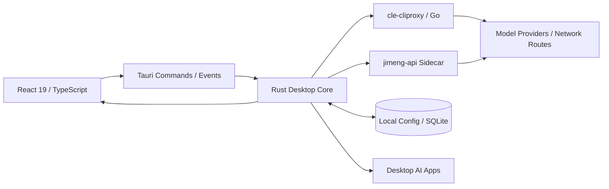

# C.le.控制台

<p align="center">
  
</p>

<p align="center">
  <strong>面向桌面 AI 工具的账户、额度、API 服务与运行状态控制台</strong>
</p>

<p align="center">
  Tauri 2 · React 19 · TypeScript · Rust · Go
</p>

## 项目简介

C.le.控制台将分散在不同 AI 客户端和命令行工具中的账户、额度、会话、代理服务与运行状态集中到一个桌面工作台中。它不是单纯的账号列表，而是一套覆盖“账户管理 → 本地 API → 模型路由 → 状态监测 → 多开与唤醒”的桌面控制层。

项目目前支持 Codex、Claude、Antigravity、Gemini、GitHub Copilot、Windsurf、Cursor、Trae、Kiro、Qoder、Zed、CodeBuddy、WorkBuddy 等平台，并提供昼夜主题、简模式、状态浮窗和自适应界面。

> 当前稳定发布版本为 **1.1.4（Windows x64）**。`main` 分支包含 1.1.4 之后的最新源码更新；这些更新尚未重新生成正式安装包。

## 主要功能

### 账户与额度

- 多平台账户统一浏览、筛选、分组、标签和备注。
- 展示周期额度、剩余时间、订阅状态、到期时间与刷新结果。
- 支持账户导入、导出、切换、应用多开和异常状态识别。
- 提供独立状态窗口，在不打开完整主界面的情况下查看关键额度和线路状态。

### 本地 API 与模型路由

- 通过 `cle-cliproxy` Go sidecar 提供本地 API 服务。
- 支持账号池、模型映射、路由策略、调用统计和服务生命周期管理。
- Rust 后端负责配置同步、状态查询、进程管理及桌面应用集成。
- 新增 Codex agent identity 处理与豆包 Seedance 请求适配。

### 即梦服务与无限画布

- 内置即梦 API 服务管理页面，可管理服务状态、配置和账户连接。
- 提供独立的 **无限画布工作区**，前后端状态链路已经接入。
- 无限画布包含开始、读取状态等 Tauri commands，不是单纯的静态展示页。
- 即梦 sidecar 源码与构建说明位于 `third_party/jimeng-api`。

### 桌面交互与视觉系统

- 昼间、夜间和简模式使用独立的对比度与性能策略。
- 开屏问候在主应用加载前直接显示，减少启动阶段的纯黑等待。
- 开屏文字使用整句过渡，并根据当前时间选择自然问候。
- 鱼形鼠标支持移动反馈和点击吐泡泡；简模式保留鼠标主体并减少拖尾开销。
- 账户页选中项使用静态高光，保留悬停反馈，降低持续动画带来的掉帧。

### 性能与稳定性

- `frameGovernor` 根据窗口状态和性能模式控制持续渲染任务。
- 页面隐藏、失焦或进入简模式时降低非关键动画与 WebGL 更新频率。
- 对高成本模糊、粒子、光束和持续脉冲效果进行分层降级，而不是整体关闭视觉效果。
- 修复额度球持续闪烁、昼间主题色不统一、浮层模糊和部分响应式布局问题。

## 最近更新

最新源码提交集中更新了以下内容：

1. **无限画布**：新增页面、样式、前端服务和 Rust commands。
2. **即梦 API**：新增本地服务模块、管理页面、sidecar 构建与冒烟测试脚本。
3. **Codex 与多模型 API**：完善本地访问、模型路由、媒体端点和身份信息处理。
4. **启动体验**：将开屏层前移到首屏入口，避免等待主应用动态加载时长时间黑屏。
5. **界面优化**：更新液态玻璃体系、账户页布局、状态窗口和昼夜/简模式适配。
6. **鱼形鼠标**：增加点击泡泡互动，移除高成本拖尾并接入帧率治理。
7. **性能治理**：减少隐藏页面和非活动窗口中的持续合成与动画工作。

完整变更记录见 [CHANGELOG.md](CHANGELOG.md)。

## 技术架构



前端不直接操作系统凭据和外部进程。需要系统权限的操作通过 Tauri command 进入 Rust 层，本地协议转换与代理服务由独立 sidecar 完成，以便分别测试和维护。

## 代码结构

```text
C.le.console/
├─ src/                         # React / TypeScript 前端
│  ├─ components/              # 通用组件与桌面交互层
│  ├─ pages/                   # 仪表盘、账户、API、无限画布等页面
│  ├─ services/                # Tauri IPC 服务封装
│  ├─ styles/                  # 主题、液态玻璃和性能样式
│  └─ utils/                   # 帧率治理、格式化和运行辅助
├─ src-tauri/                   # Tauri / Rust 桌面后端
│  └─ src/
│     ├─ commands/             # 前端可调用命令
│     ├─ models/               # Rust 数据结构
│     └─ modules/              # 账户、额度、代理、窗口和服务模块
├─ sidecars/
│  └─ cle-cliproxy/            # Go 本地 API sidecar
├─ third_party/
│  └─ jimeng-api/              # 即梦 sidecar 源码与许可证
├─ crates/                     # Rust workspace 公共模块与 CLI
├─ scripts/                    # 开发、构建、测试和发布脚本
└─ release/                    # 已确认的稳定版发布文件
```

## 开发环境

### Windows

- Node.js 20+
- npm
- Rust stable（MSVC toolchain）
- Go（与 `sidecars/cle-cliproxy/go.mod` 兼容）
- Visual Studio 2022 Build Tools
- Microsoft Edge WebView2 Runtime

安装依赖：

```powershell
npm ci
```

启动前端开发环境：

```powershell
npm run dev
```

启动 Tauri 开发环境：

```powershell
$env:GOCACHE = "$PWD\target\go-cache"
npm run tauri -- dev
```

执行主要检查：

```powershell
npm run build
cargo check --manifest-path src-tauri/Cargo.toml

Push-Location sidecars\cle-cliproxy
go test ./...
Pop-Location
```

构建 Windows 安装包：

```powershell
$env:GOCACHE = "$PWD\target\go-cache"
npm run tauri -- build --bundles nsis --no-sign
```

### macOS 状态

源码中已经包含较多 macOS 条件分支、原生菜单、Keychain、通知和应用路径处理，但当前仓库发布物仍然只有 Windows x64 版本。要生成可用的 `.app` 或 `.dmg`，还需要：

- 在 macOS 设备上完成原生构建与运行验证。
- 为 Apple Silicon 或 Intel Mac 编译对应 sidecar。
- 将打包目标从 Windows `nsis` 扩展到 macOS `app`/`dmg`。
- 完成应用签名、公证和系统权限验证。

因此，现有 `.exe` 不能直接在 macOS 上运行。

## 构建状态

最新源码已通过：

- `npm run build`
- `cargo check --manifest-path src-tauri/Cargo.toml`
- `go test ./...`（`sidecars/cle-cliproxy`）

前端构建仍会提示部分大型资源块超过 Vite 默认警戒值，这是性能优化的后续工作，不影响本次编译通过。

## 数据与隐私

- 仓库不包含真实账户、OAuth token、API key、Cookie、日志或本机数据库。
- 运行数据写入用户本机应用数据目录，不进入源码目录。
- `node_modules`、`dist`、`target`、测试截图、调试 profile 和安装备份均不应提交。
- 本地调试脚本和未经验证的构建产物不会随普通源码更新发布。

## 发布说明

- 当前稳定发布版本：`v1.1.4`。
- `main` 是最新源码分支，可能领先于稳定安装包。
- 正式版本应通过 Git tag 与 GitHub Release 发布。
- 不要将未经完整 Tauri 构建和验证的安装包作为正式版本上传。

## 联系方式

- GitHub: [Cle0726](https://github.com/Cle0726)
- QQ: `3478658158`
- 微信二维码：应用内进入 **设置 → 关于 / About** 查看

## 许可证

项目代码按 **CC BY-NC-SA 4.0** 提供，详见 [LICENSE](LICENSE)。第三方目录遵循其各自许可证：

- `sidecars/cle-cliproxy/cdk/CLIProxyAPI`：目录内 MIT License
- `third_party/jimeng-api`：目录内独立许可证
