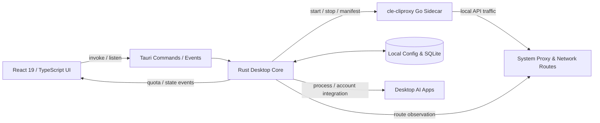

# C.le.控制台

> **C.le. Console — AI Model Operations & Route Observatory**  
> 当前稳定版：**1.1.4** · Windows x64 · Tauri 2 + React 19 + Rust + Go

C.le.控制台是一套面向桌面 AI 工具的账户、额度、API 服务与网络出口统一控制台。项目将高密度管理能力拆分为仪表盘、模型工作台、账户页、API 服务页、出口线路页和设置页，并以昼夜双主题、动态几何模型、轻量状态窗和中英双语信息层级保持一致的视觉体验。

本目录是可直接公开的 **1.1.4 最新完整版本**：源码、安装程序和便携运行文件均来自同一次最终构建，不包含旧版本安装包、旧版说明、历史宣传素材、测试截图、缓存、日志或本机账户数据。

## 1. 核心能力

### 1.1 视觉与交互

- 默认启动页为 **仪表盘 / Dashboard**。
- 六套独立动态几何模型随机切换，不再重复使用同一造型。
- 几何主体、环绕轨道、粒子与鼠标位移联动；支持自动旋转与暂停策略。
- 黑猫入口位于顶部中间，点击后展开模型与功能导航，收起时保留展示空间。
- 白天、黑夜和简洁模式使用独立对比度体系，避免文字与控件在不同主题下失读。
- 开屏问候、日期和时间根据系统时间动态生成，中英文字体与整体网格一致。
- 程序与项目图片统一圆角、裁切和阴影规则，减少“贴图感”。

### 1.2 模型与账户

- 支持 Codex、Claude、Antigravity、Gemini、GitHub Copilot、Windsurf、Cursor、Trae、Kiro、Qoder、Zed、CodeBuddy、WorkBuddy 等平台账户管理。
- 展示模型当前额度、周期额度、订阅状态、到期时间与刷新结果。
- 支持账户导入、导出、标签、分组、备注、会话管理、应用多开与唤醒操作。
- 账户页面与仪表盘共用同一套排版、色板、网格、描边和状态语义。

### 1.3 本地 API 服务

- 内置 `cle-cliproxy` Go sidecar，为本地 API 服务提供统一代理与模型路由。
- 支持账号池、模型映射、路由策略、调用统计和服务状态管理。
- Rust 后端负责 sidecar 生命周期、配置同步、状态查询和桌面进程集成。
- 可选的 Chat2API、AuroraProxy 快捷启动不再绑定任何开发者电脑路径；如需使用，分别设置 `CLE_CHAT2API_PATH`、`CLE_AURORA_PATH` 为对应 EXE 的完整路径。

### 1.4 真实出口线路监测

- 读取本机真实代理与连接信息，不使用演示或伪造数据。
- 重点展示 **线路 / Route** 与 **规则 / Rule**，而非堆叠无关流量指标。
- 分类监测：本地 API 服务、桌面 ChatGPT、桌面 Claude、其他。
- 实际出口与设定出口不一致时触发醒目的异常提示。
- “其他”按豁免线路处理，不产生错误误报。
- 线路数据缺失时显示“未观测 / Not observed”，不会伪装成正常数据。

### 1.5 自适应状态窗

- 主窗口点击最小化后自动进入状态窗，而不是退出程序。
- 状态窗仅保留模型额度、周期进度、出口线路、异常状态和重新检测等关键数据。
- 左右模块各占 50%，窗口内容随原生窗口尺寸连续缩放。
- 默认逻辑尺寸 `480 × 288`，最小逻辑尺寸 `420 × 270`，可自由拖拽放大。
- 在高 DPI 与大尺寸窗口下同步放大字体、额度球、间距和控件，而不是只扩大空白区域。

## 2. 运行架构



前端不直接读取系统凭据或操作外部进程。所有需要系统权限的工作都通过 Tauri command 进入 Rust 层；本地 API 协议转换由独立 Go sidecar 完成。这样可以将界面、系统集成和代理服务分开测试与维护。

## 3. 代码结构

```text
C.le.console/
├─ src/                         # React 前端
│  ├─ assets/                  # 应用图标、模型素材、联系二维码
│  ├─ components/              # 通用控件、弹窗、工具栏和业务组件
│  ├─ contexts/                # 主题、语言和应用级上下文
│  ├─ data/                    # 平台、出口监测和界面静态定义
│  ├─ hooks/                   # 账户页、查询和交互逻辑复用
│  ├─ locales/                 # 多语言 JSON
│  ├─ pages/                   # 仪表盘、账户、API、设置、状态窗等页面
│  ├─ presentation/            # 展示层模型与格式化
│  ├─ services/                # IPC、数据迁移与前端服务
│  ├─ stores/                  # Zustand 状态
│  ├─ styles/                  # 全局主题、平台页和响应式样式
│  ├─ types/                   # TypeScript 类型
│  ├─ utils/                   # 格式化、导入导出与辅助方法
│  ├─ App.tsx                  # 页面路由、窗口模式和全局交互入口
│  └─ main.tsx                 # React 启动入口
├─ src-tauri/                   # Tauri 桌面应用
│  ├─ capabilities/            # Tauri 权限声明
│  ├─ icons/                   # Windows/macOS 应用图标
│  ├─ native/                  # macOS 原生菜单桥接
│  ├─ resources/               # 打包资源占位与运行资源
│  ├─ src/
│  │  ├─ commands/             # 前端可调用的 Tauri commands
│  │  ├─ models/               # Rust 数据结构
│  │  ├─ modules/              # 账户、额度、进程、代理、窗口等核心模块
│  │  └─ utils/                # Rust 通用工具
│  ├─ build.rs                 # 构建 Go sidecar 并交给 Tauri 打包
│  ├─ Cargo.toml               # 桌面端 Rust 依赖
│  └─ tauri.conf.json          # 产品名、窗口、资源和打包配置
├─ crates/
│  ├─ cle-core/                # 可复用 Rust 核心模块
│  └─ cle-cli/                 # 命令行入口
├─ sidecars/
│  └─ cle-cliproxy/            # 本地 API Go sidecar
│     ├─ cdk/CLIProxyAPI/      # 所需第三方协议实现源码
│     ├─ main.go               # sidecar 主入口
│     └─ go.mod                # Go 模块与本地 replace
├─ scripts/                     # 版本同步、Tauri 启动、构建和校验脚本
├─ release/                     # 本次 1.1.4 最终成品
│  ├─ C.le.控制台_1.1.4_x64-setup.exe
│  ├─ portable/                # 完整便携运行目录
│  └─ SHA256SUMS.txt           # 文件校验值
├─ announcements.json           # 当前公告源；默认无历史公告与推广
├─ remote-config.json           # 远端规则配置入口
├─ Cargo.toml / Cargo.lock      # Rust workspace
├─ package.json / package-lock.json
├─ vite.config.ts
└─ README.md                    # 本说明（仓库唯一项目 Markdown 文档）
```

## 4. 关键运行流程

### 启动

1. Tauri 创建主窗口并初始化本地配置、日志和系统集成。
2. React 完成主题、语言和首屏状态恢复。
3. 开屏动画按当前时间生成问候，并在资源就绪后进入仪表盘。
4. 本地 API 服务按配置决定是否启动 `cle-cliproxy`。

### 最小化与恢复

1. 主窗口最小化事件进入 Rust 窗口控制模块。
2. 主窗口隐藏，状态窗以当前主题和关键数据打开。
3. 状态窗关闭或恢复操作重新显示主窗口。
4. 恢复保护使用状态代次与稳定等待，避免窗口在快速切换时发生竞态。

### 出口监测

1. Rust 读取目标桌面进程、连接与系统代理状态。
2. 监测结果按本地 API、ChatGPT、Claude、其他归类。
3. 前端将实际线路与设定线路逐项比较。
4. 不一致项显示异常；没有样本的项保持“未观测”；其他线路保持豁免。

## 5. 开发环境

### Windows 必需项

- Node.js 20 或更高版本
- npm
- Rust stable（MSVC toolchain）
- Go 1.26 或与 `sidecars/cle-cliproxy/go.mod` 兼容的版本
- Microsoft Visual Studio 2022 Build Tools（Desktop development with C++）
- Microsoft Edge WebView2 Runtime
- NSIS（Tauri CLI 通常会自动准备所需工具）

### 安装依赖

```powershell
npm ci
```

### 前端开发

```powershell
npm run dev
```

### Tauri 开发

```powershell
$env:GOCACHE = "$PWD\target\go-cache"
npm run tauri -- dev
```

### 静态检查

```powershell
npm run typecheck
$env:GOCACHE = "$PWD\target\go-cache"
cargo check --workspace
Push-Location sidecars\cle-cliproxy
go test ./...
Pop-Location
```

### 生产构建

```powershell
$env:GOCACHE = "$PWD\target\go-cache"
npm run tauri -- build --bundles nsis --no-sign
```

主要输出：

```text
target/release/C.le.控制台.exe
target/release/cle-cliproxy.exe
target/release/bundle/nsis/C.le.控制台_1.1.4_x64-setup.exe
```

## 6. 1.1.4 成品校验

| 文件 | SHA-256 |
|---|---|
| `release/C.le.控制台_1.1.4_x64-setup.exe` | `97dedb4a05355999902f13768d79fc4a0b442a3782f77b78fe9e0315c3d14d58` |
| `release/portable/C.le.控制台.exe` | `64e2f294f55b343f587278468989b444b0061f60c485d49fa34fd9b1744783f4` |
| `release/portable/cle-cliproxy.exe` | `9d8193a15ef038953eefa65ed2cc2ed0d5a3c434820f0f64d10d6e8e5b0b2600` |

完整资源校验见 `release/SHA256SUMS.txt`。

## 7. 数据与隐私

- 仓库不包含真实账户、OAuth token、API key、Cookie、日志、SQLite 数据库或本机代理记录。
- 运行数据写入用户本机应用数据目录，不进入源码目录。
- `announcements.json` 已清空历史公告、推广、旧版本跳转与旧资源。
- `node_modules`、`dist`、`target`、调试 profile、测试截图和安装备份均已排除。
- 提交前建议再次执行凭据扫描，并核对 `git status` 中只有预期文件。

## 8. 发布约定

- 仓库只保留当前稳定版源码和当前稳定版可执行文件。
- 后续版本通过 Git tag 与 GitHub Release 保存，不在主分支堆放多代安装包。
- `release/portable` 必须整体移动，不能只复制其中的主程序 EXE。
- 当前仓库未配置远程地址，也没有执行上传；可由维护者自行绑定 GitHub 仓库。

## 9. 联系方式

- GitHub: [Cle0726](https://github.com/Cle0726)
- QQ: `3478658158`
- 电话: `15678144635`
- 微信二维码：应用内进入 **设置 → 关于 / About** 查看

## 10. 许可

项目代码按 **CC BY-NC-SA 4.0** 提供；详见根目录 `LICENSE`。`sidecars/cle-cliproxy/cdk/CLIProxyAPI` 使用其目录内的 MIT License。第三方依赖分别遵循各自许可证。
